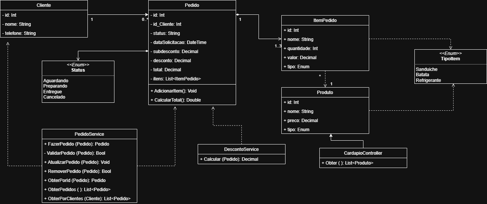

# 🍔Good Hamburger

## 📖 Sobre o Projeto
Good Hamburger é uma lanchonete focada em oferecer uma experiência simples, rápida e de qualidade no atendimento dos pedidos.

Este projeto consiste na criação de uma API REST em ASP NET Core para fazer o gerenciamento de pedidos, permitindo registrar, consultar, atualizar e remover pedidos, além de disponibilizar um cardápio.

O objetivo principal é demonstrar boas práticas de desenvolvimento backend, incluindo organização de código, separação de responsabilidades e modelagem de domínio.

## 🎯 Objetivo do Desafio
- Construir uma API REST em ASP NET Core.
- Implementar CRUD completo de pedidos.
- Aplicar regras de negócio (subtotal, desconto e total).
- Validar dados e tratar erros corretamente.
- Expor endpoint de cardápio.

## 🛠️ Tecnologias Utilizadas

- .NET 8
- ASP.NET Core Web API
- SQL Server
- Entity Framework Core
- C#
- Swagger (OpenAPI)

## Diagrama UML


## 📂 Estrutura do Projeto

```
GoodHamburger.Orders.API
│
├── Context			# Classe central do EFCore
├── Controllers     # Endpoints da API
├── Services        # Regras de negócio
├── Models          # Entidades do domínio
```
